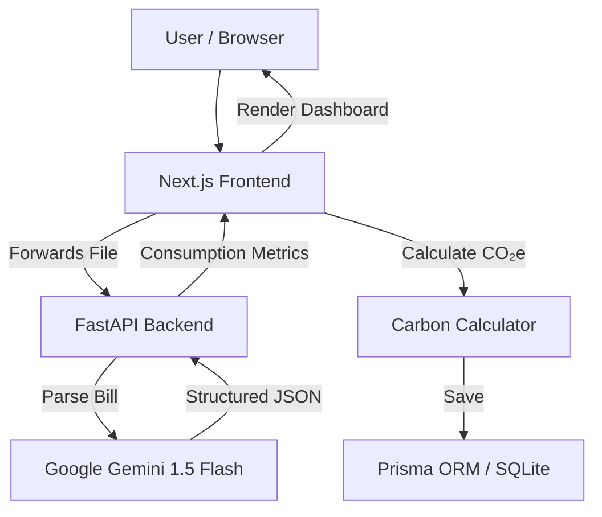

# EcoTrace AI 🌍

**Carbon Footprint Tracking & Awareness Platform**

EcoTrace AI helps individuals understand, track, and reduce their carbon footprint through simple actions and personalized insights. Upload utility bills (PDF, PNG, JPEG) and our AI-powered pipeline — built on **Google Gemini 1.5 Flash Vision** — extracts consumption metrics and converts them into kilograms of CO₂ equivalent (kg CO₂e).

---

## ✨ Key Features

- **AI-Powered Bill Parsing**: Upload utility bills and Gemini Flash Vision extracts consumption data automatically with PII redaction.
- **Real-Time Carbon Dashboard**: Visualize emissions breakdown by category (Electricity, Gas, Water) with interactive Recharts pie and area charts.
- **Personalized Insights Engine**: Dynamic, threshold-based eco-tips generated from your actual consumption patterns.
- **Action Center Checklist**: Commit to carbon-reducing initiatives, track completion, and see your avoided emissions grow.
- **Avoided Emissions Tracking**: Calculates and displays kilograms of CO₂e you are actively preventing.
- **WCAG 2.1 AA Accessible**: Screen reader announcements, keyboard navigation, and chart fallback tables.

---

## 🛠️ Tech Stack

| Layer | Technology |
|---|---|
| **Frontend** | Next.js 16 (App Router), TypeScript, TailwindCSS, Recharts, Lucide Icons |
| **Backend** | FastAPI (Python 3.12), Pydantic v2, Google Generative AI SDK |
| **Database** | Prisma ORM with SQLite |
| **Testing** | Vitest + Testing Library (frontend), pytest (backend) |
| **Security** | Rate limiting, CSP headers, CORS restrictions, PII redaction, input validation |
| **CI/CD** | GitHub Actions → Google Cloud Run (containerized) |

---

## 📂 Project Structure

```text
├── .github/workflows/
│   └── deploy.yml                 # CI/CD pipeline for Google Cloud Run
├── backend/
│   ├── app/
│   │   ├── api/endpoints.py       # FastAPI routes with rate limiting
│   │   ├── services/llm_parser.py # Gemini Vision parsing with PII redaction
│   │   ├── config.py              # Pydantic settings management
│   │   └── schemas.py             # Strict Pydantic v2 response schemas
│   ├── tests/test_ingestion.py    # 6 pytest tests (validation, rate limit, mocks)
│   ├── Dockerfile                 # Production container
│   ├── main.py                    # FastAPI app with CORS & exception handling
│   └── requirements.txt
├── frontend/
│   ├── prisma/schema.prisma       # Bill, EmissionFactor, Action, UserAction models
│   ├── src/
│   │   ├── app/
│   │   │   ├── actions.ts         # Server Actions (upload, delete, commit, toggle)
│   │   │   ├── layout.tsx         # Root layout with SEO metadata
│   │   │   ├── page.tsx           # Server Component dashboard entry
│   │   │   └── globals.css        # Dark theme styles
│   │   ├── components/dashboard/
│   │   │   ├── DashboardClient.tsx # Client-side state coordinator
│   │   │   ├── BillUploadZone.tsx  # Drag-and-drop upload with progressive states
│   │   │   ├── EmissionsCharts.tsx # Pie + Area charts with SR fallback tables
│   │   │   ├── ActionCenter.tsx    # Reduction hub: insights, initiatives, checklist
│   │   │   └── ActivityStream.tsx  # Bill history with delete controls
│   │   ├── lib/
│   │   │   ├── repositories/      # Repository pattern (billRepository, actionRepository)
│   │   │   ├── services/          # InsightsEngine for dynamic tip generation
│   │   │   ├── prisma.ts          # Prisma Client singleton
│   │   │   └── carbonCalculator.ts # Emission factor lookup with unit conversion
│   │   ├── middleware.ts           # Security headers (CSP, X-Frame-Options, etc.)
│   │   └── __tests__/             # Vitest test suites
│   ├── vitest.config.ts
│   ├── Dockerfile                  # Multi-stage standalone production build
│   └── package.json
└── README.md
```

---

## 🚀 Getting Started

### Prerequisites

- **Node.js** v20+
- **Python** 3.12+
- **Google Gemini API Key** from [Google AI Studio](https://aistudio.google.com)

### 1. Backend Setup

```bash
cd backend
cp .env.example .env          # Then add your GEMINI_API_KEY
python -m venv venv
venv\Scripts\activate          # Windows
source venv/bin/activate       # macOS/Linux
pip install -r requirements.txt
python -m uvicorn main:app --host 127.0.0.1 --port 8000 --reload
```

### 2. Frontend Setup

```bash
cd frontend
cp .env.example .env
npm install
npx prisma db push            # Initialize SQLite database
npm run dev                    # http://localhost:3000
```

---

## 🧪 Testing

### Backend Tests (6 tests)

```bash
cd backend
PYTHONPATH=.. pytest tests     # Linux/macOS
$env:PYTHONPATH=".." ; venv\Scripts\pytest tests   # Windows PowerShell
```

Tests cover:
- File type validation (reject non-PDF/PNG/JPEG)
- File size validation (reject > 5MB)
- Empty file validation
- LLM parser mock success
- LLM parser mock failure (502 handling)
- Rate limiter (429 after 5 requests/minute)

### Frontend Tests (7 tests)

```bash
cd frontend
npm run test
```

Tests cover:
- InsightsEngine threshold analysis (4 tests — electricity, gas, water, balanced)
- BillUploadZone progressive state transitions (3 tests — idle, success flow, error flow)

---

## 🔒 Security Architecture

| Protection | Implementation |
|---|---|
| **Rate Limiting** | Sliding-window limiter: 5 uploads/min per IP on `/api/v1/ingest` |
| **Content Security Policy** | Strict CSP via Next.js middleware |
| **Clickjacking Prevention** | `X-Frame-Options: DENY` |
| **MIME Sniffing Prevention** | `X-Content-Type-Options: nosniff` |
| **CORS Restriction** | Whitelisted origins only (localhost:3000, localhost:8080) |
| **PII Redaction** | Gemini prompt explicitly filters names, addresses, account numbers |
| **Exception Redaction** | Global handler strips stack traces from API error responses |
| **Input Validation** | Pydantic `gt=0` constraints, `Literal` type enforcement |
| **File Sanitization** | Filename regex stripping before database storage |
| **Permissions Policy** | Camera, microphone, geolocation disabled via headers |

---

## ♿ Accessibility (WCAG 2.1 AA)

- `aria-live="polite"` announcements during upload state transitions
- `role="button"` with keyboard `Enter`/`Space` triggers on upload zone
- Visually-hidden fallback data tables for screen readers alongside charts
- Semantic HTML5 elements with proper heading hierarchy
- Focus ring indicators (`focus:ring-2 focus:ring-emerald-500`)

---

## 🏗️ Architecture



---

## 🚀 CI/CD Deployment

Both services deploy to **Google Cloud Run** via GitHub Actions on push to `main`.

### Required GitHub Secrets

| Secret | Description |
|---|---|
| `GCP_PROJECT_ID` | Google Cloud Project ID |
| `GCP_SA_KEY` | Service Account JSON key file contents |
| `GEMINI_API_KEY` | Gemini API key for the backend container |
| `DATABASE_URL` | Production database connection string |

---

## 📄 License

MIT License — © 2026 EcoTrace AI
